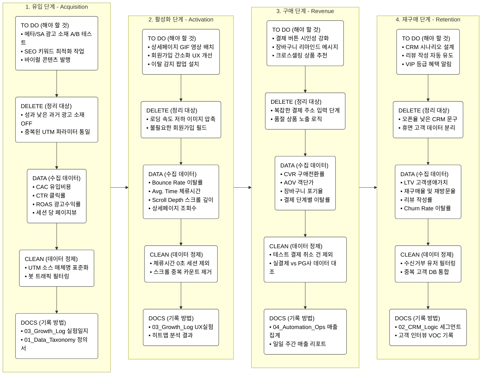

1 단계 : 유입 => 2 단계 : 활성화 => 3 단계 : 구매 => 4 단계 : 재구매

----
### 📂 관련 문서 바로가기

- [[01_Data_Taxonomy|📊 데이터 정의서 열기]]
- [[02_CRM_Logic|💌 CRM 시나리오 열기]]
- [[03_Growth_Log|⚗️ 그로스 실험 일지 열기]]
- [[04_Automation_Ops|🤖 자동화 성과 열기]]

[[바이트몰_광고 퍼널.canvas|바이트몰_광고 퍼널]]
[[바이트 50M 전략.canvas|바이트 50M 전략]]
